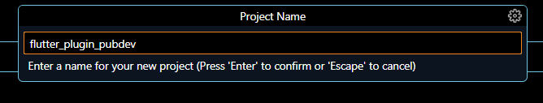
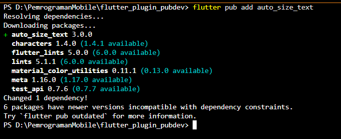
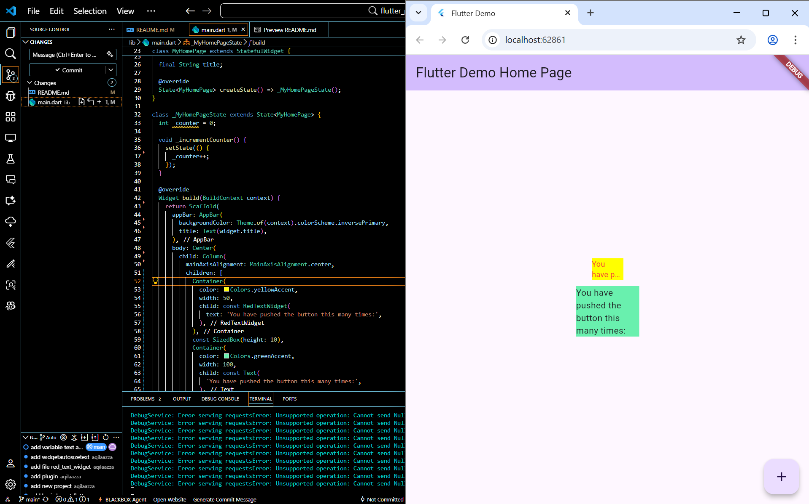

**NAMA LENGKAP : AQILA NUR AZZA**
<br>**KELAS : 3C**
<br>**NIM : 2341760022**
<br>**JOBSHEET 6: MANAJEMEN PLUGIN**

--------------------------------------------------------------------------------------------------------------------------------------

**Praktikum Menerapkan Plugin di Project Flutter**
<br>Selesaikan langkah-langkah praktikum berikut ini menggunakan editor Visual Studio Code (VS Code) atau Android Studio atau code editor lain kesukaan Anda.
<br>Perhatian: Diasumsikan Anda telah berhasil melakukan setup environment Flutter SDK, VS Code, Flutter Plugin, dan Android SDK pada pertemuan pertama.
<br>Langkah 1: Buat Project Baru
<br>Buatlah sebuah project flutter baru dengan nama flutter_plugin_pubdev. Lalu jadikan repository di GitHub Anda dengan nama flutter_plugin_pubdev.
<p align="center">
  
</p>
<br>Langkah 2: Menambahkan Plugin
<br>Tambahkan plugin auto_size_text menggunakan perintah berikut di terminal 'flutter pub add auto_size_text'
<p align="center">
  
</p>
<br>Jika berhasil, maka akan tampil nama plugin beserta versinya di file pubspec.yaml pada bagian dependencies.
<br>Tampilan pada file pubspec_yaml

```dart
auto_size_text: ^3.0.0
```
<br>Tampilan pada file pubspec_lock

```dart
  auto_size_text:
    dependency: "direct main"
    description:
      name: auto_size_text
      sha256: "3f5261cd3fb5f2a9ab4e2fc3fba84fd9fcaac8821f20a1d4e71f557521b22599"
      url: "https://pub.dev"
    source: hosted
    version: "3.0.0"
```
<br>Langkah 3: Buat file red_text_widget.dart
<br>Buat file baru bernama red_text_widget.dart di dalam folder lib lalu isi kode seperti berikut.

```dart
import 'package:flutter/material.dart';

class RedTextWidget extends StatelessWidget {
  const RedTextWidget({Key? key}) : super(key: key);

  @override
  Widget build(BuildContext context) {
    return Container();
  }
}
```
<br>>Langkah 4: Tambah Widget AutoSizeText
<br>Masih di file red_text_widget.dart, untuk menggunakan plugin auto_size_text, ubahlah kode return Container() menjadi seperti berikut.

```dart
return AutoSizeText(
          text,
          style: const TextStyle(color: Colors.red, fontSize: 14),
          maxLines: 2,
          overflow: TextOverflow.ellipsis,
    );
```
<br>Setelah Anda menambahkan kode di atas, Anda akan mendapatkan info error. Mengapa demikian? Jelaskan dalam laporan praktikum Anda!
<br>Jawab : Terdapat dua penyebab error di red_text_widget.dart: paket AutoSizeText belum diimpor, dan kelas RedTextWidget belum memiliki properti text. Maka dari itu, perlu ditambahkan import 'package:auto_size_text/auto_size_text.dart'; serta mendeklarasikan final String text; dan parameter konstruktor required this.text di dalam kelas RedTextWidget.

<br>Langkah 5: Buat Variabel text dan parameter di constructor
<br>Tambahkan variabel text dan parameter di constructor seperti berikut.

```dart
import 'package:flutter/material.dart';
import 'package:auto_size_text/auto_size_text.dart';

class RedTextWidget extends StatelessWidget {
  final String text;

  const RedTextWidget({Key? key, required this.text}) : super(key: key);

  @override
  Widget build(BuildContext context) {
     return AutoSizeText(
          text,
          style: const TextStyle(color: Colors.red, fontSize: 14),
          maxLines: 2,
          overflow: TextOverflow.ellipsis,
    );
  }
}
```

<br>Langkah 6: Tambahkan widget di main.dart
<br>Buka file main.dart lalu tambahkan di dalam children: pada class _MyHomePageState

```dart
Container(
              color: Colors.yellowAccent,
              width: 50,
              child: const RedTextWidget(
                text: 'You have pushed the button this many times:',
              ),
            ),
            Container(
              color: Colors.greenAccent,
              width: 100,
              child: const Text(
                'You have pushed the button this many times:',
              ),
            ),
```

<br>Run aplikasi tersebut dengan tekan F5, maka hasilnya akan seperti berikut.
<p align="center">
  
</p>

--------------------------------------------------------------------------------------------------------------------------------------

**Tugas**

1. Jelaskan maksud dari langkah 2 pada praktikum tersebut!

```dart
flutter pub add auto_size_text
```

Jawab : Langkah 2 bertujuan untuk menambahkan dependency (plugin) bernama auto_size_text ke dalam project Flutter.
Plugin ini digunakan agar teks dapat menyesuaikan ukuran font-nya secara otomatis agar tetap muat di dalam batas layout tanpa terpotong.
Perintah flutter pub add auto_size_text akan menambahkan plugin tersebut ke bagian dependencies: pada file pubspec.yaml, sehingga Flutter tahu bahwa project membutuhkan pustaka ini saat dijalankan.

2. Jelaskan maksud dari langkah 5 pada praktikum tersebut!

```dart
final String text;

const RedTextWidget({Key? key, required this.text}) : super(key: key);
```

Jawab : Langkah 5 menambahkan variabel dan parameter konstruktor pada kelas RedTextWidget.
Tujuannya agar widget tersebut dapat menerima input teks dari luar, sehingga lebih fleksibel dan dapat digunakan berulang kali dengan teks yang berbeda.


3. Pada langkah 6 terdapat dua widget yang ditambahkan, jelaskan fungsi dan perbedaannya!

```dart
Container(
              color: Colors.yellowAccent,
              width: 50,
              child: const RedTextWidget(
                text: 'You have pushed the button this many times:',
              ),
            ),
            Container(
              color: Colors.greenAccent,
              width: 100,
              child: const Text(
                'You have pushed the button this many times:',
              ),
            ),
```
Jawab : 

- Container pertama (warna kuning) menggunakan widget RedTextWidget yang menampilkan teks dengan gaya khusus (Text berwarna merah) menggunakan plugin auto_size_text.
→ Ini adalah widget custom buatan sendiri.

- Container kedua (warna hijau) menggunakan widget Text bawaan Flutter tanpa penyesuaian otomatis ukuran font.
→ Ini adalah widget bawaan default Flutter.

- Perbedaannya, RedTextWidget bisa menyesuaikan ukuran teks secara otomatis agar tetap muat di tempatnya, sedangkan Text hanya menampilkan teks biasa tanpa bisa menyesuaikan ukuran kalau teksnya terlalu panjang.


4. Jelaskan maksud dari tiap parameter yang ada di dalam plugin auto_size_text berdasarkan tautan pada dokumentasi ini !

### Parameter dan Contoh Penggunaan Plugin `AutoSizeText`

| **Parameter** | **Fungsinya** | **Contoh Penggunaan** |
|----------------|---------------|------------------------|
| **text** | Menentukan teks yang akan ditampilkan pada widget. | `text: 'Hello Flutter'` |
| **style** | Mengatur tampilan teks seperti warna, ukuran, dan jenis font. | `style: TextStyle(color: Colors.red, fontSize: 16)` |
| **maxLines** | Membatasi jumlah baris maksimal teks yang bisa ditampilkan. | `maxLines: 2` |
| **overflow** | Menentukan bagaimana teks yang terlalu panjang akan ditampilkan, misalnya dengan tanda “...”. | `overflow: TextOverflow.ellipsis` |
| **minFontSize** | Menentukan ukuran font terkecil yang diperbolehkan ketika teks otomatis mengecil. | `minFontSize: 10` |
| **maxFontSize** | Menentukan ukuran font terbesar yang diperbolehkan untuk teks. | `maxFontSize: 20` |
| **stepGranularity** | Mengatur tingkat kehalusan perubahan ukuran font saat teks menyesuaikan ruangnya. | `stepGranularity: 0.5` |
| **wrapWords** | Mengatur apakah kata boleh dipotong saat teks disesuaikan. Jika `false`, kata tidak akan dipecah. | `wrapWords: true` |
| **softWrap** | Menentukan apakah teks boleh berpindah ke baris berikutnya ketika tidak muat dalam satu baris. | `softWrap: true` |
| **presetFontSizes** | Menentukan daftar ukuran font yang bisa dicoba secara otomatis oleh widget agar teks tetap pas. | `presetFontSizes: [18, 16, 14, 12]` |
| **textAlign** | Mengatur perataan teks (kiri, kanan, tengah, atau justify). | `textAlign: TextAlign.center` |
| **overflowReplacement** | Menentukan widget pengganti yang akan ditampilkan jika teks tidak bisa ditampilkan sama sekali. | `overflowReplacement: Text('Teks terlalu panjang')` |


Plugin auto_size_text memudahkan pengembang agar teks otomatis menyesuaikan ruang tampilan tanpa memotong atau melampaui batas layout, sehingga tampilan UI tetap rapi dan responsif.

