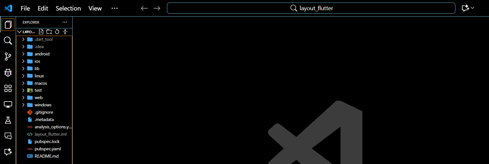
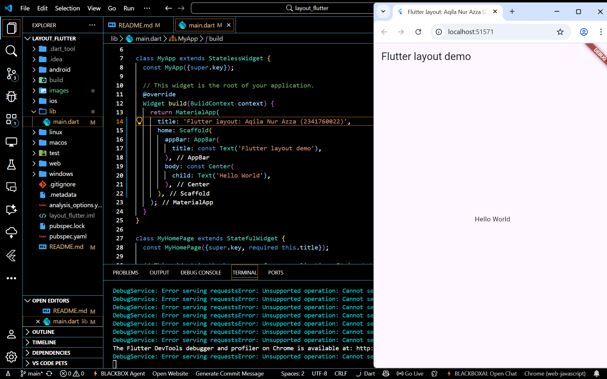
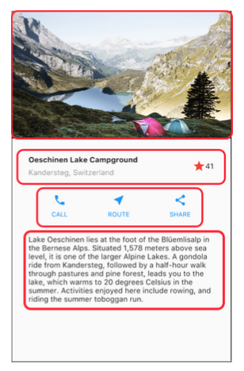
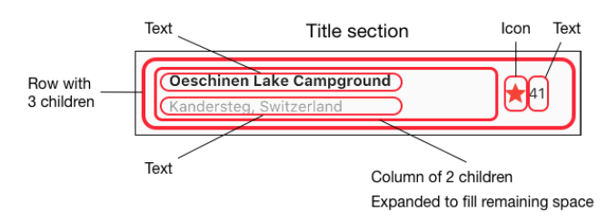
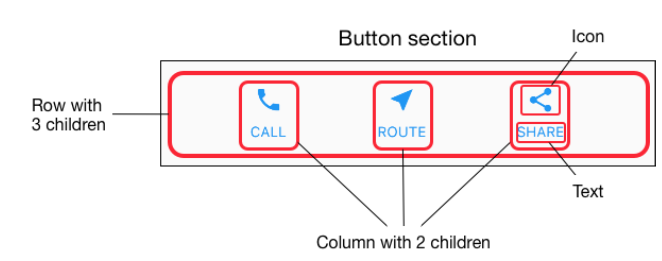
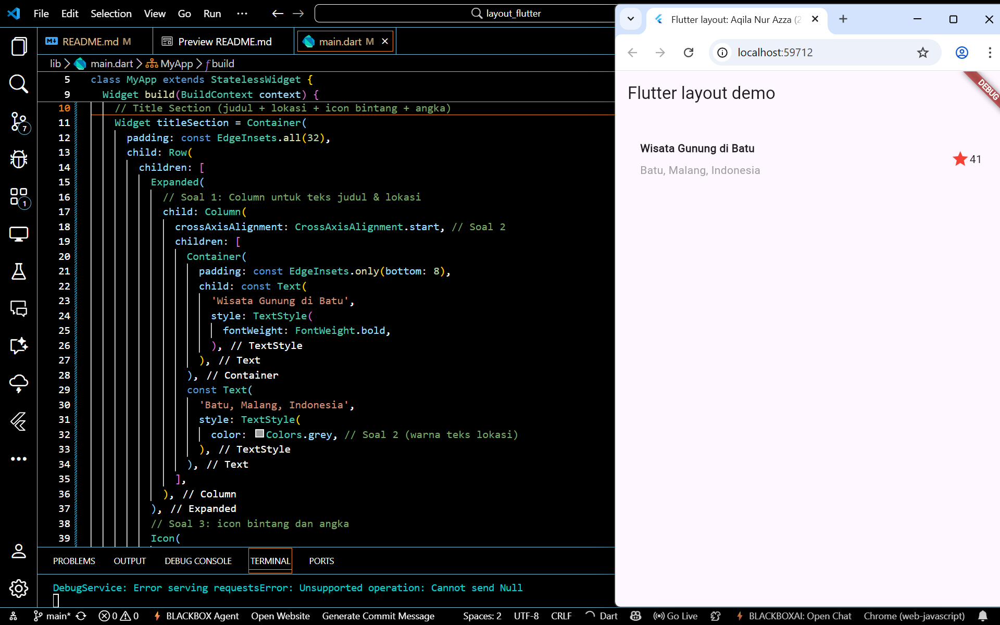
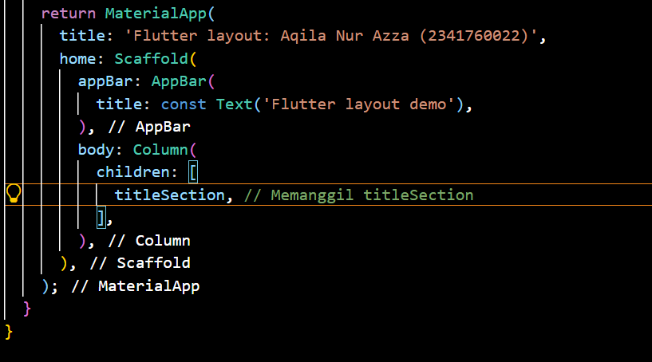

**NAMA LENGKAP : AQILA NUR AZZA**
 **KELAS : 3C**
 **NIM : 2341760022**
 **JOBSHEET 5 FLUTTER 2: LAYOUT DAN NAVIGASI**

--------------------------------------------------------------------------------------------------------------------------------------

Praktikum 1: Membangun Layout di Flutter

 Langkah 1: Buat Project Baru
 Buatlah sebuah project flutter baru dengan nama layout_flutter. Atau sesuaikan style laporan praktikum yang Anda buat.

 Langkah 2: Buka file lib/main.dart
 Buka file main.dart lalu ganti dengan kode berikut. Isi nama dan NIM Anda di text title.

 Langkah 3: Identifikasi layout diagram
 Langkah pertama adalah memecah tata letak menjadi elemen dasarnya:
   Identifikasi baris dan kolom.
   Apakah tata letaknya menyertakan kisi-kisi (grid)?
   Apakah ada elemen yang tumpang tindih?
   Apakah UI memerlukan tab?
   Perhatikan area yang memerlukan alignment, padding, atau borders.

 Pertama, identifikasi elemen yang lebih besar. Dalam contoh ini, empat elemen disusun menjadi sebuah kolom: sebuah gambar, dua baris, dan satu blok teks.

 Selanjutnya, buat diagram setiap baris. Baris pertama, disebut bagian Judul, memiliki 3 anak: kolom teks, ikon bintang, dan angka. Anak pertamanya, kolom, berisi 2 baris teks. Kolom pertama itu memakan banyak ruang, sehingga harus dibungkus dengan widget yang Diperluas.

 Baris kedua, disebut bagian Tombol, juga memiliki 3 anak: setiap anak merupakan kolom yang berisi ikon dan teks.

 Setelah tata letak telah dibuat diagramnya, cara termudah adalah dengan menerapkan pendekatan bottom-up. Untuk meminimalkan kebingungan visual dari kode tata letak yang banyak bertumpuk, tempatkan beberapa implementasi dalam variabel dan fungsi.
 Langkah 4: Implementasi title row
 Pertama, Anda akan membuat kolom bagian kiri pada judul. Tambahkan kode berikut di bagian atas metode build() di dalam kelas MyApp:

/* soal 1 */ Letakkan widget Column di dalam widget Expanded agar menyesuaikan ruang yang tersisa di dalam widget Row. Tambahkan properti crossAxisAlignment ke CrossAxisAlignment.start sehingga posisi kolom berada di awal baris.

/* soal 2 */ Letakkan baris pertama teks di dalam Container sehingga memungkinkan Anda untuk menambahkan padding = 8. Teks ‘Batu, Malang, Indonesia' di dalam Column, set warna menjadi abu-abu.

/* soal 3 */ Dua item terakhir di baris judul adalah ikon bintang, set dengan warna merah, dan teks "41". Seluruh baris ada di dalam Container dan beri padding di sepanjang setiap tepinya sebesar 32 piksel. Kemudian ganti isi body text ‘Hello World' dengan variabel titleSection seperti berikut:

