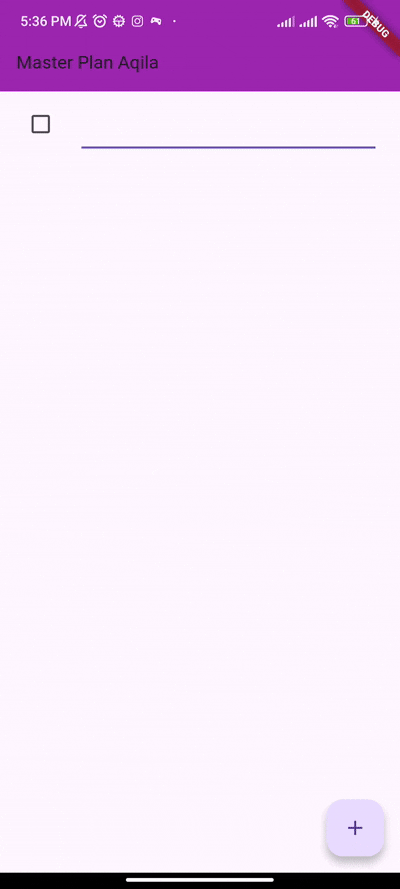
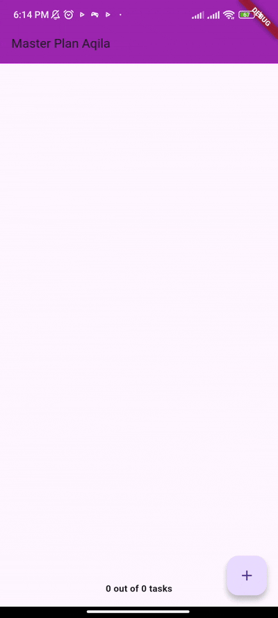
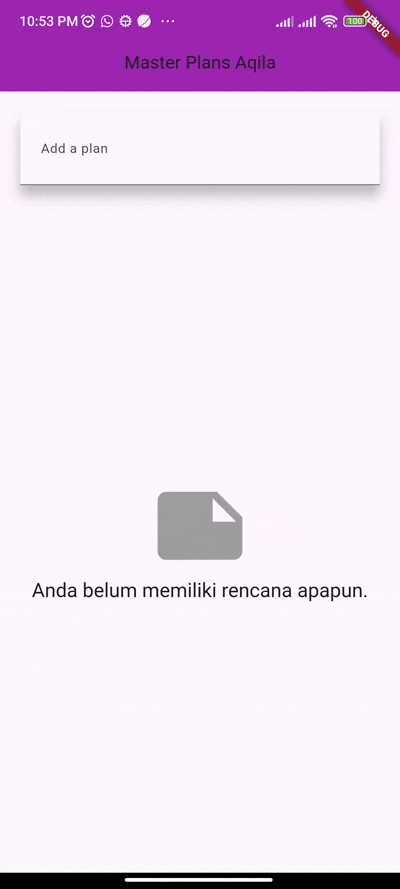

**NAMA LENGKAP : AQILA NUR AZZA**
 **KELAS : 3C**
 **NIM : 2341760022**
 **JOBSHEET 10: DASAR STATE MANAGEMENT**

--------------------------------------------------------------------------------------------------------------------------------------

**Praktikum 1: Dasar State dengan Model-View**

Penjelasan : 

Aplikasi Master Plan menampilkan daftar tugas dengan kotak centang dan tombol “+” untuk menambah tugas baru. Tampilan menggunakan AppBar ungu dengan judul “Master Plan Aqila”. Method initState() digunakan untuk mengatur scrollController agar keyboard otomatis tertutup saat scroll, sedangkan dispose() membersihkan scrollController agar memori tidak bocor.

**Praktikum 2: Mengelola Data Layer dengan InheritedWidget dan InheritedNotifier**

Penjelasan : 

Aplikasi Master Plan yang dibuat dengan Flutter menampilkan daftar tugas (to-do list) dengan fitur untuk menambahkan tugas baru dan menandai tugas yang sudah selesai. Di bagian bawah daftar terdapat footer yang menampilkan progress tugas, misal “2 out of 5 tasks”, sehingga pengguna bisa melihat berapa banyak tugas yang sudah selesai. Setiap perubahan pada daftar tugas langsung terlihat di layar berkat penggunaan state management sederhana dengan InheritedNotifier dan ValueNotifier, sehingga tampilan selalu mengikuti kondisi data terbaru.

**Praktikum 3: Membuat State di Multiple Screens**

Penjelasan : 

Pada langkah ke-14 ini, aplikasi Master Plan sudah dapat dijalankan secara utuh. Aplikasi menampilkan alur kerja mulai dari pembuatan rencana hingga pengelolaan daftar tugas di dalamnya.
Awalnya, pengguna dapat menambahkan rencana baru melalui kolom input pada halaman utama. Setelah rencana ditambahkan, daftar rencana akan langsung muncul di tampilan. Ketika pengguna memilih salah satu rencana, aplikasi berpindah ke halaman detail menggunakan proses navigasi.
Di halaman detail tersebut, pengguna dapat menambahkan tugas baru dengan menekan tombol “+”. Setiap tugas yang muncul dapat diedit atau diberi tanda centang untuk menandakan bahwa tugas tersebut telah selesai. Selain itu, di bagian bawah halaman terdapat informasi yang menunjukkan seberapa banyak tugas yang telah diselesaikan dari seluruh daftar.
