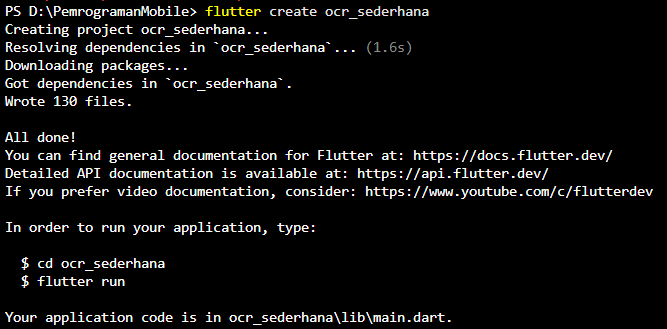
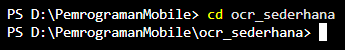
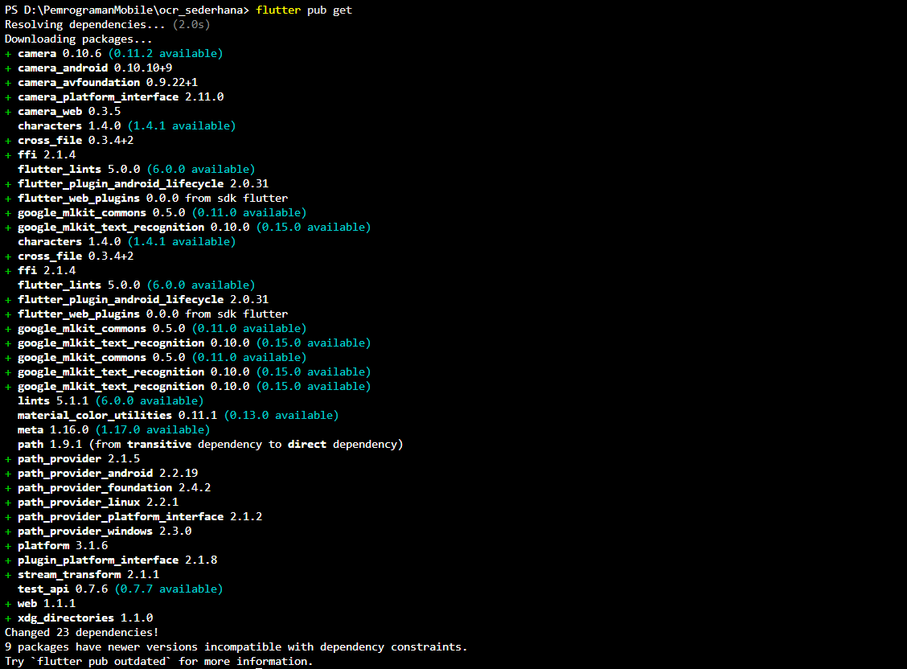
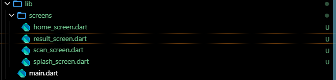
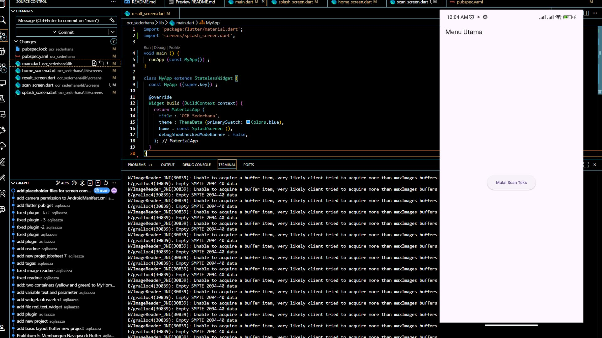
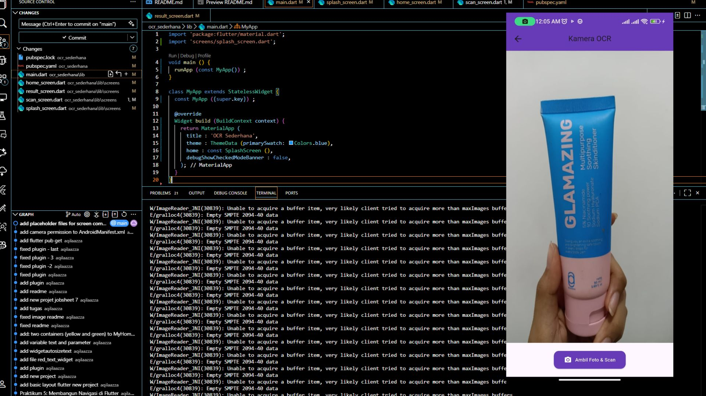
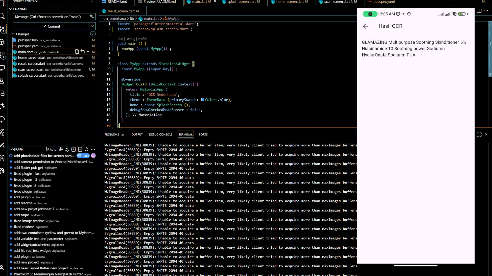
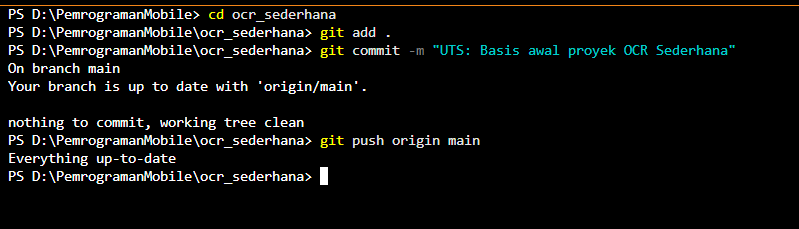

**NAMA LENGKAP : AQILA NUR AZZA**
<br>**KELAS : 3C**
<br>**NIM : 2341760022**
<br>**JOBSHEET 6: MANAJEMEN PLUGIN**

--------------------------------------------------------------------------------------------------------------------------------------

**4.1. Langkah 1: Buat Proyek Baru**

Buka terminal, lalu jalankan:

<p align="center">
  
</p>

<p align="center">
  
</p>
 
**4.2. Langkah 2: Tambahkan Plugin**

Buka file pubspec.yaml, lalu tambahkan dependensi berikut di bawah bagian dependencies:
```dart
dependencies:
  flutter:
    sdk: flutter
  cupertino_icons: ^1.0.8
  google_mlkit_text_recognition: ^0.10.0
  camera : ^0.10.5+5
  path_provider : ^2.1.2
  path : ^1.8.3
```

Simpan file lalu jalankan 

<p align="center">
  
</p>

**4.3. Langkah 3: Tambahkan Izin Kamera (Android)**

Buka file: android/app/src/main/AndroidManifest.xml

Tambahkan baris berikut di dalam tag <manifest>, sebelum <application>:

```dart
<uses-permission android:name="android.permission.CAMERA" />
```

**4.4. Langkah 4: Buat Struktur Folder**

Di dalam folder lib/, buat struktur berikut:

<p align="center">
  
</p>

5. KODE PROGRAM

5.1. File: lib/main.dart
```dart
    import 'package:flutter/material.dart';
    import 'screens/splash_screen.dart';

    void main () {
    runApp (const MyApp()) ;
    }

    class MyApp extends StatelessWidget {
    const MyApp ({super.key}) ;

    @override
    Widget build (BuildContext context) {
        return MaterialApp (
        title : 'OCR Sederhana',
        theme : ThemeData (primarySwatch: Colors.blue),
        home : const SplashScreen (),
        debugShowCheckedModeBanner : false,
        );
    }
    }
```
5.2. File: lib/screens/splash screen.dart
```dart
    import 'dart:async';
    import 'package:flutter/material.dart';
    import 'home_screen.dart';

    class SplashScreen extends StatefulWidget {
    const SplashScreen({super.key});

    @override
    State<SplashScreen> createState() => _SplashScreenState();
    }

    class _SplashScreenState extends State<SplashScreen> {
    @override
    void initState() {
        super.initState();
        Timer(const Duration(seconds: 2), () {
        Navigator.pushReplacement(
            context,
            MaterialPageRoute(builder: (_) => const HomeScreen()),
        );
        });
    }

    @override
    Widget build(BuildContext context) {
        return Scaffold(
        backgroundColor: Colors.blue,
        body: Center(
            child: Column(
            mainAxisAlignment: MainAxisAlignment.center,
            children: const [
                CircularProgressIndicator(color: Colors.white),
                SizedBox(height: 20),
                Text(
                'OCR Scanner',
                style: TextStyle(color: Colors.white, fontSize: 24),
                ),
            ],
            ),
        ),
        );
    }
    }
```
5.3. File: lib/screens/home screen.dart
```dart
    import 'package:flutter/material.dart';
    import 'scan_screen.dart';

    class HomeScreen extends StatelessWidget {
    const HomeScreen({super.key});

    @override
    Widget build(BuildContext context) {
        return Scaffold(
        appBar: AppBar(title: const Text('Menu Utama')),
        body: Center(
            child: ElevatedButton(
            onPressed: () {
                Navigator.push(
                context,
                MaterialPageRoute(builder: (_) => const ScanScreen()),
                );
            },
            child: const Text('Mulai Scan Teks'),
            ),
        ),
        );
    }
    }
```
5.4. File: lib/screens/scan screen.dart
```dart
    import 'dart:io';
    import 'package:flutter/material.dart';
    import 'package:camera/camera.dart';
    import 'package:google_mlkit_text_recognition/google_mlkit_text_recognition.dart';
    import 'package:path_provider/path_provider.dart';
    import 'result_screen.dart';

    late List<CameraDescription> cameras;

    class ScanScreen extends StatefulWidget {
    const ScanScreen({super.key});

    @override
    State<ScanScreen> createState() => _ScanScreenState();
    }

    class _ScanScreenState extends State<ScanScreen> {
    CameraController? _controller; // gunakan nullable agar aman
    late Future<void> _initializeControllerFuture;

    @override
    void initState() {
        super.initState();
        _initCamera();
    }

    /// Inisialisasi kamera
    void _initCamera() async {
        try {
        cameras = await availableCameras();
        _controller = CameraController(
            cameras.first,
            ResolutionPreset.medium,
        );

        _initializeControllerFuture = _controller!.initialize();
        await _initializeControllerFuture;

        if (mounted) {
            setState(() {});
        }
        } catch (e) {
        debugPrint('Error initializing camera: $e');
        }
    }

    @override
    void dispose() {
        _controller?.dispose();
        super.dispose();
    }

    /// Proses OCR dari file gambar
    Future<String> _ocrFromFile(File imageFile) async {
        final inputImage = InputImage.fromFile(imageFile);
        final textRecognizer = TextRecognizer(script: TextRecognitionScript.latin);
        final RecognizedText recognizedText =
            await textRecognizer.processImage(inputImage);
        textRecognizer.close();
        return recognizedText.text;
    }

    /// Ambil foto lalu pindah ke halaman hasil
    Future<void> _takePicture() async {
        if (_controller == null) return;

        try {
        await _initializeControllerFuture;

        if (!mounted) return;

        ScaffoldMessenger.of(context).showSnackBar(
            const SnackBar(
            content: Text('Memproses OCR, mohon tunggu...'),
            duration: Duration(seconds: 2),
            ),
        );

        final XFile image = await _controller!.takePicture();
        final ocrText = await _ocrFromFile(File(image.path));

        if (!mounted) return;
        Navigator.push(
            context,
            MaterialPageRoute(
            builder: (_) => ResultScreen(ocrText: ocrText),
            ),
        );
        } catch (e) {
        if (!mounted) return;
        ScaffoldMessenger.of(context)
            .showSnackBar(SnackBar(content: Text('Error: $e')));
        }
    }

    @override
    Widget build(BuildContext context) {
        // Jika controller belum siap, tampilkan loading
        if (_controller == null || !_controller!.value.isInitialized) {
        return const Scaffold(
            body: Center(
            child: CircularProgressIndicator(),
            ),
        );
        }

        return Scaffold(
        appBar: AppBar(
            title: const Text('Kamera OCR'),
            centerTitle: true,
            backgroundColor: Colors.deepPurple,
        ),
        body: Column(
            children: [
            Expanded(
                child: AspectRatio(
                aspectRatio: _controller!.value.aspectRatio,
                child: CameraPreview(_controller!),
                ),
            ),
            Padding(
                padding: const EdgeInsets.all(16.0),
                child: ElevatedButton.icon(
                style: ElevatedButton.styleFrom(
                    backgroundColor: Colors.deepPurple,
                    padding:
                        const EdgeInsets.symmetric(horizontal: 24, vertical: 12),
                    shape: RoundedRectangleBorder(
                    borderRadius: BorderRadius.circular(12),
                    ),
                ),
                onPressed: _takePicture,
                icon: const Icon(Icons.camera_alt, color: Colors.white),
                label: const Text(
                    'Ambil Foto & Scan',
                    style: TextStyle(color: Colors.white),
                ),
                ),
            ),
            ],
        ),
        );
    }
    }
```
5.5. File: lib/screens/result screen.dart
```dart
    import 'package:flutter/material.dart';

    class ResultScreen extends StatelessWidget {
    final String ocrText;

    const ResultScreen({super.key, required this.ocrText});

    @override
    Widget build(BuildContext context) {
        return Scaffold(
        appBar: AppBar(title: const Text('Hasil OCR')),
        body: Padding(
            padding: const EdgeInsets.all(16.0),
            child: SingleChildScrollView(
            child: SelectableText(
                ocrText.isEmpty
                    ? 'Tidak ada teks ditemukan.'
                    : ocrText.replaceAll('\n', ' '),
                style: const TextStyle(fontSize: 18),
            ),
            ),
        ),
        );
    }
    }
```

--------------------------------------------------------------------------------------------------------------------------------------

**6. TUGAS PRAKTIKUM**

1. Jalankan aplikasi di emulator atau HP.
<p align="center">
  
</p>
2. Lakukan scan terhadap teks cetak (misal: buku, koran, atau layar HP).
<p align="center">
  
</p>
3. Amati hasil OCR yang muncul.
<p align="center">
  
</p>
4. Jawab pertanyaan berikut:

a. Apakah semua teks terbaca dengan akurat? Mengapa?

Tidak semua teks terbaca dengan akurat.
Hal ini disebabkan oleh beberapa faktor seperti kualitas gambar (buram, gelap, atau terlalu terang), jenis dan ukuran font, kontras antara teks dan latar belakang, serta sudut pengambilan gambar yang miring. Semakin jelas dan kontras gambar teksnya, hasil pembacaan OCR akan semakin akurat.

b. Apa kegunaan fitur OCR dalam kehidupan sehari-hari?

Fitur OCR (Optical Character Recognition) berguna untuk mengubah teks dari gambar menjadi teks digital yang bisa diedit, disalin, dan disimpan. Dalam kehidupan sehari-hari, OCR membantu mempermudah proses digitalisasi dokumen, pencarian teks dalam foto, serta mempercepat pekerjaan administrasi tanpa perlu mengetik ulang.

c. Sebutkan 2 contoh aplikasi nyata yang menggunakan OCR!

- Google Lens – untuk mengenali teks dari foto, papan nama, atau dokumen dan langsung menerjemahkannya.

- Microsoft Office Lens – untuk memindai dokumen, papan tulis, atau catatan dan mengubahnya menjadi file Word atau PDF yang bisa diedit.

--------------------------------------------------------------------------------------------------------------------------------------

**NAMA LENGKAP : AQILA NUR AZZA**
<br>**KELAS : 3C**
<br>**NIM : 2341760022**
<br>**ULANGAN TENGAH SEMESTER**

--------------------------------------------------------------------------------------------------------------------------------------

Instruksi Awal (SETUP) - Wajib
<br>1.	Pastikan proyek ocr_sederhana sudah diinisialisasi sebagai repositori Git dan ter- hubung ke akun GitHub Anda.
<br>2.	Lakukan commit awal untuk memastikan branch main Anda bersih.

```dart
    git add .
    git commit -m "UTS: Basis awal proyek OCR Sederhana" 
    git push origin main
```

<p align="center">
  
</p>

--------------------------------------------------------------------------------------------------------------------------------------

**Soal 1:	Modifikasi Struktur Navigasi dan Aliran (30 Poin)**

Tujuan: Menyederhanakan alur navigasi dan meningkatkan pengalaman pengguna di
HomeScreen.
 
1.	Pengubahan Navigasi Home (15 Poin):

•	Ubah ElevatedButton di HomeScreen (lib/screens/home_screen.dart) men- jadi *widget* **ListTile**.

•	Atur ListTile: leading: Icon(Icons.camera_alt, color:	Colors.blue); title: Text(’Mulai Pindai Teks Baru’).

•	Fungsi onTap harus menggunakan Navigator.push() untuk ke ScanScreen.

2.	Teks Utuh dan Navigasi Balik (15 Poin):

•	Di ResultScreen (lib/screens/result_screen.dart), hapus fungsi ocrText.replaceAll

agar hasil teks ditampilkan dengan baris baru (\n) yang utuh.

•	Tambahkan FloatingActionButton dengan ikon Icons.home.

•	Ketika tombol ditekan, navigasi harus kembali langsung ke HomeScreen meng- gunakan **Navigator.pushAndRemoveUntil()** (atau metode yang setara) untuk menghapus semua halaman di atasnya dari stack navigasi.

--------------------------------------------------------------------------------------------------------------------------------------

**Soal 2: Penyesuaian Tampilan dan Penanganan State/Error (40 Poin)**

1.	Custom Loading Screen di ScanScreen (20 Poin):

•	Di ScanScreen (lib/screens/scan_screen.dart), modifikasi tampilan *load- ing* yang muncul sebelum kamera siap (if (!controller.value.isInitialized)) :

•	Latar Belakang:	Scaffold(backgroundColor:	Colors.grey[900]).

•	Isi:	Di dalam Center, tampilkan Column berisi CircularProgressIndicator(col Colors.yellow).
•	Di bawah indikator, tambahkan Text(’Memuat Kamera...	Harap tunggu.’, style:	TextStyle(color:	Colors.white, fontSize:	18)).

2.	Spesifikasi Pesan Error (20 Poin):

•	Di fungsi _takePicture() pada ScanScreen, modifikasi blok catch (e) un- tuk mengubah pesan *error* pada SnackBar.

•	Pesan SnackBar harus berbunyi: "Pemindaian Gagal! Periksa Izin Kam- era atau coba lagi." (Hilangkan variabel *error* ($e)).

--------------------------------------------------------------------------------------------------------------------------------------
**Soal 3: Implementasi Plugin Text-to-Speech (TTS) (30 Poin)**

1.	Instalasi Plugin (5 Poin):

•	Tambahkan *plugin* flutter_tts ke dalam file pubspec.yaml (gunakan versi terbaru yang kompatibel).

•	Jalankan flutter pub get.

2.	Konversi Widget dan Inisialisasi (10 Poin):

•	Ubah ResultScreen dari StatelessWidget menjadi **StatefulWidget**.

•	Di initState(), inisialisasi FlutterTts dan atur bahasa pembacaan menjadi Bahasa Indonesia.

•	Implementasikan dispose() untuk menghentikan mesin TTS saat halaman ditutup.

3.	Fungsionalitas Pembacaan (15 Poin):

•	Tambahkan FloatingActionButton kedua di ResultScreen (atau ganti AppBar
dengan action button) dengan ikon Icons.volume_up.

•	Ketika tombol ditekan, panggil fungsi speak() pada FlutterTts untuk mem- bacakan seluruh isi ocrText.


